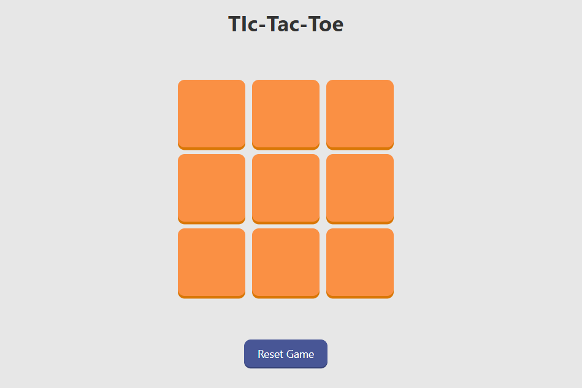
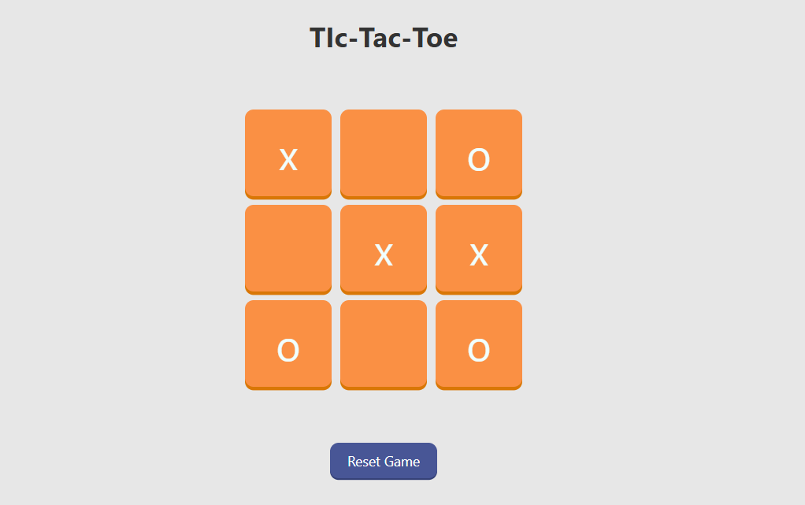
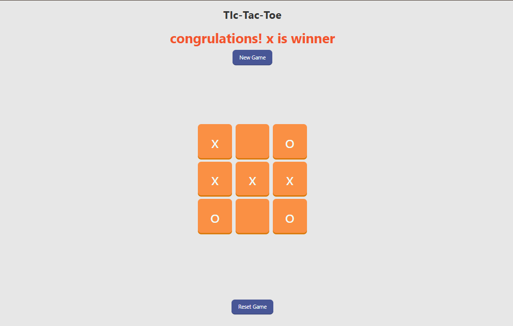

# 🎮 Tic-Tac-Toe Game

A simple **Tic-Tac-Toe** game built using **HTML, CSS, and JavaScript**.  
Play against a friend in this classic 3x3 grid game.

---

## 📌 Features
- 🟢 Two-player mode (Player X vs Player O)  
- 🟢 Detects win, lose, or draw conditions  
- 🟢 Reset / Restart functionality  
- 🟢 Simple and responsive design using CSS  

---

## 🚀 Live Demo
[Click here to play](http://127.0.0.1:5500/Tic-Tac-Toe/) <!-- Replace `#` with your live demo link if hosted -->

---

## 🛠️ Technologies Used
- **HTML5** – Game structure  
- **CSS3** – Styling and layout  
- **JavaScript (ES6)** – Game logic  

---

## 📂 Project Structure

- tic-tac-toe/
-│── index.html # Main HTML file
-│── style.css # Styling
-│── script.js # Game logic
-└── README.md # Documentation


---

## ▶️ How to Play
1. Open the game in your browser.  
2. Player **X** starts first.  
3. Players take turns placing their symbol (X or O) on the 3x3 grid.  
4. The first player to align three of their symbols **horizontally, vertically, or diagonally** wins.  
5. If all cells are filled without a winner, the game ends in a **draw**.  

---

## 📸 Screenshots
_ 
_ 
_ 

---

## 💻 Setup Instructions
1. Clone the repository:
   ```bash
   git clone https://github.com/FarwaRafiq/Tic-Tac-Toe.git
